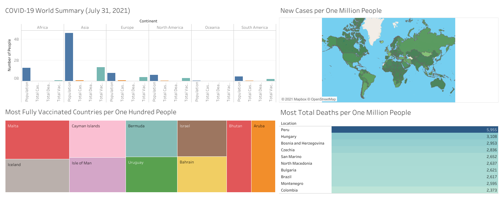

# Project 1: COVID-19 EDA (SQL and Tableau)

This repository is for the analysis done on the Our World in Data: COVID-19 dataset. Below you will find an overview of the data, code, and results. The goal of this project was to create two dashboards summarizing the status of COVID-19 using Tableau (where one dashboard is for the world and the other is for the US).

## Coronavirus Dataset

The dataset was gathered from [Our World in Data](https://ourworldindata.org/coronavirus) and, at the time of collection, spanned from February 24, 2020 to July 31, 2021. The dataset contained 59 variables for 218 countries which are contained within six Microsoft Excel spreadsheets. There was a spreadsheet for each of the following: cases, deaths, testing, hospitalizations and ICU patients, vaccinations, and country demographics.

### Variables
`continent`, `location`, `date`, `total_cases`, `new_cases`, `new_cases_smoothed`, `total_deaths`, `new_deaths`, `new_deaths_smoothed`, `total_cases_per_million`, `new_cases_per_million`, `new_cases_smoothed_per_million`, `total_deaths_per_million`, `new_deaths_per_million`, `new_deaths_smoothed_per_million`, `reproduction_rate`, `icu_patients`, `icu_patients_per_million`, `hosp_patients`, `hosp_patients_per_million`, `weekly_icu_admissions`, `weekly_icu_admissions_per_million`, `weekly_hosp_admissions`, `weekly_hosp_admissions_per_million`, `total_tests`, `new_tests`, `total_tests_per_thousand`, `new_tests_per_thousand`, `new_tests_smoothed`, `new_tests_smoothed_per_thousand`, `positive_rate`, `tests_per_case`, `tests_units`, `total_vaccinations`, `people_vaccinated`, `people_fully_vaccinated`, `new_vaccinations`, `new_vaccinations_smoothed`, `total_vaccinations_per_hundred`, `people_vaccinated_per_hundred`, `people_fully_vaccinated_per_hundred`, `new_vaccinations_smoothed_per_million`, `stringency_index`, `population`, `population_density`, `median_age`, `aged_65_older`, `aged_70_older`, `gdp_per_capita`, `extreme_poverty`, `cardiovasc_death_rate`, `diabetes_prevalence`, `female_smokers`, `male_smokers`, `handwashing_facilities`, `hospital_beds_per_thousand`, `life_expectancy`, `human_development_index`, `excess_mortality`

## COVID19_Queries.sql

This file contains the 27 queries I performed in SQL Server on the dataset. Seven views were created to aid in creating the data tables used in Tableau.

## Results

## Resources

1. [Our World in Data. Statistics and Research: Coronavirus Pandemic (COVID-19).](https://ourworldindata.org/coronavirus)
2. [YouTube. Alex The Analyst: Data Analyst Portfolio Project | SQL Data Exploration | Project 1/4.](https://www.youtube.com/watch?v=qfyynHBFOsM)
3. [YouTube. Alex The Analyst: Data Analyst Portfolio Project | Tableau Visualization | Project 2/4.](https://www.youtube.com/watch?v=QILNlRvJlfQ)
4. [SQLShack.](https://www.sqlshack.com/)
5. [LearnSQL.](https://www.LearnSQL.com/blog/)
