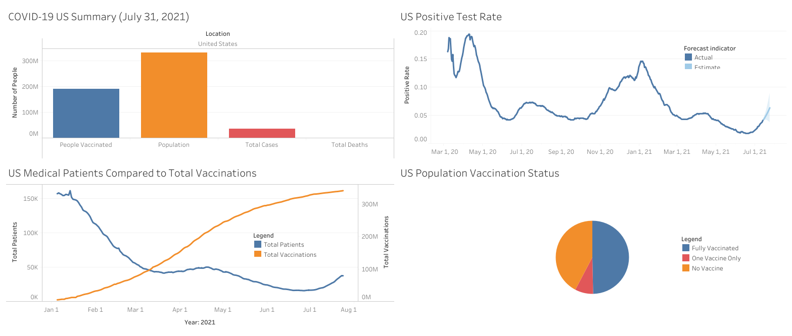

# Project 1: COVID-19 EDA (SQL and Tableau)

This repository is for the analysis done on the Our World in Data: COVID-19 dataset. Below you will find an overview of the data, code, and results.

## About the Dataset

The dataset was 

## SQL Queries

## Results

## Resources

1. [Our World in Data. Statistics and Research: Coronavirus Pandemic (COVID-19).](https://ourworldindata.org/coronavirus)
2. [YouTube. Alex The Analyst: Data Analyst Portfolio Project | SQL Data Exploration | Project 1/4.](https://www.youtube.com/watch?v=qfyynHBFOsM)
3. [YouTube. Alex The Analyst: Data Analyst Portfolio Project | Tableau Visualization | Project 2/4.](https://www.youtube.com/watch?v=QILNlRvJlfQ)
4. [SQLShack.](https://www.sqlshack.com/)
5. [LearnSQL.](LearnSQL.com/blog/)
